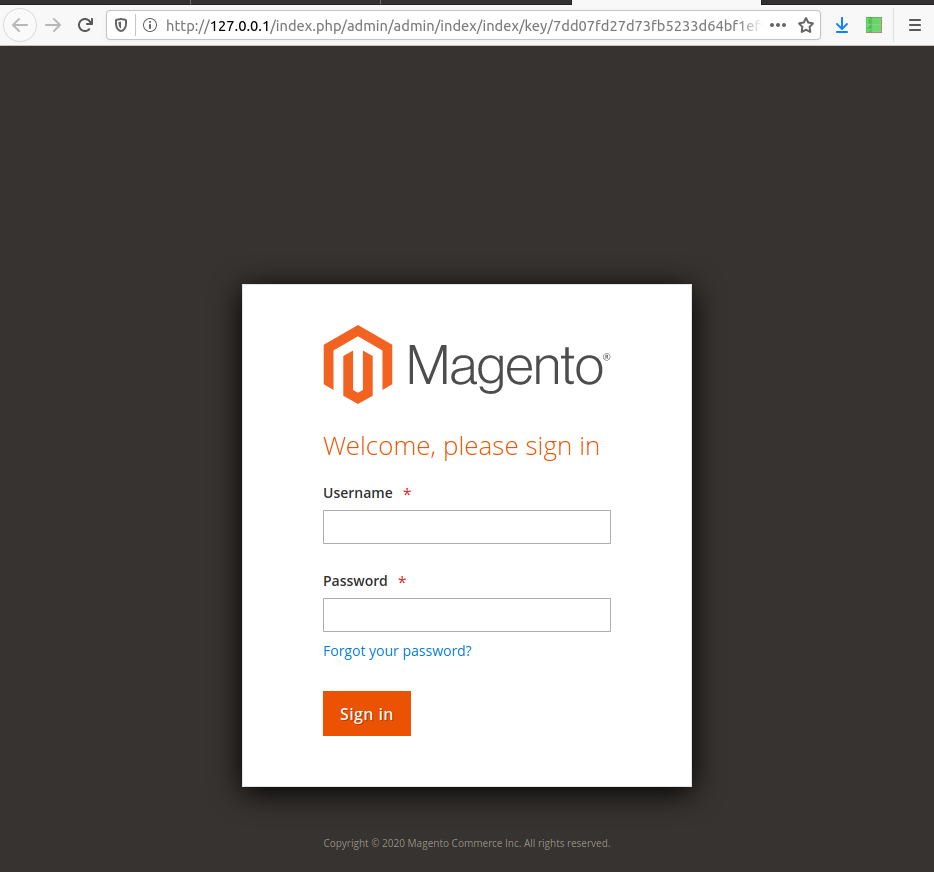
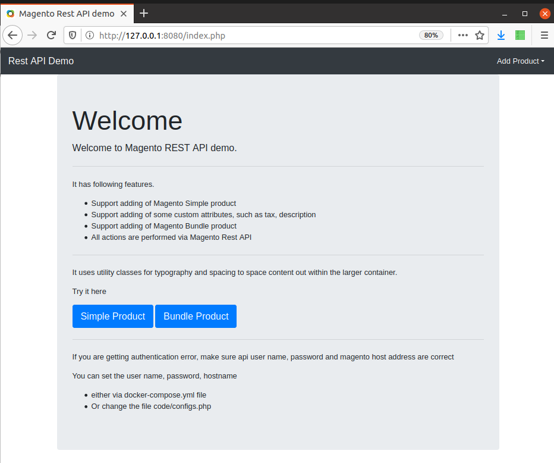

# Magento REST API demo
This is a sample of Magento REST API access to manipulate Magento store catalouge

## Features
The following are supported.

### Adding simple products
A simple product can be added to the catalouge. For a simple product minimum required fields are SKU, product name and price. Other values such as for Attribute set, tax calss, quantity, stock status, weight, visibility and description can also be set.

### Adding custom attributes
Custom attributes such as tax class and description are supported. It does not support all possible attributes yet.

### Adding Bundle product
Adding bundle product is possible.

## Requirements

- Docker
- Ports 80,443 must be free

## Docker
This project uses docker container to deploy mariadb, elastic search and magento containers. These containers are set up and configured with sample data for testing the REST API. After running the containers you can check the Magento store at [https://127.0.0.1](https://127.0.0.1), please make sure that port 80 and 443 is not already occupied.

## Testing, deploying
Clone the repository to a folder called "burgur". Or rename the folder to burgur after having cloned to any directory. Docker will name the containers burgur_* because of this. Otherwise hostname will need to be adjusted accordingly.

Then run the command from inside the folder where is also the docker-compose.yml file.

```
$ docker-compose up -d
```

This will download the images and then run them. It takes a few minutes. To stop use the following command.

```
$ docker-compose down
```

## Magento store home page
Check the magento store home page at [https://127.0.0.1](https://127.0.0.1)

The admin panel at [https://127.0.0.1/admin](https://127.0.0.1/admin)

The PHP form is available at [https://127.0.0.1:8080](https://127.0.0.1:8080)

If you cannot see these than most likely you have something using the ports 80 and 443, Nginx or Apache or Mamp, Wamp or Xampp etc.

## Screenshots

Here are some screenshots.





